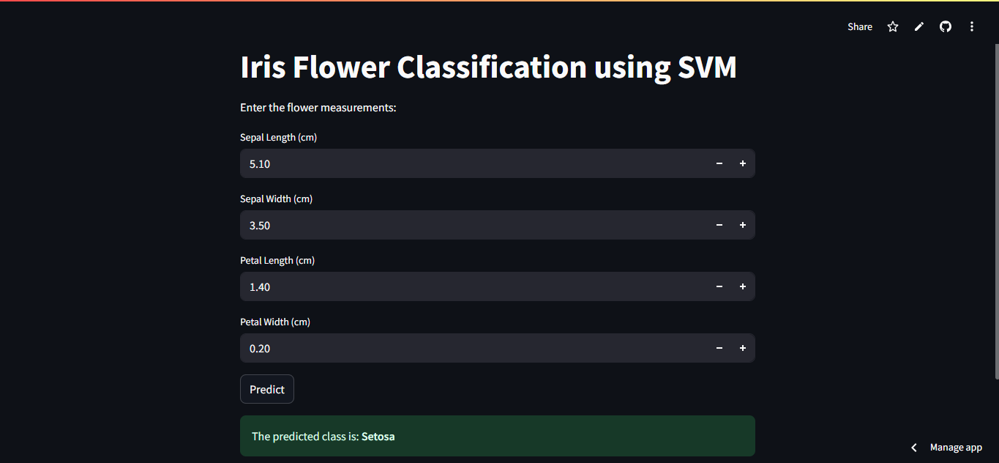

# 🌸 Iris Flower Classification with SVM and Streamlit

This project demonstrates a **Machine Learning model** built with **Support Vector Machine (SVM)** to classify iris flower species. The model is trained using the famous **Iris dataset from scikit-learn** and deployed using **Streamlit** for a user-friendly web interface.

---

## 🔍 Features

- Classifies iris species: **Setosa**, **Versicolor**, **Virginica**  
- Uses **SVM classifier** with linear kernel  
- Real-time prediction via **Streamlit web app**  
- Clean UI for inputting sepal and petal measurements

---

## 🧠 Machine Learning Pipeline

1. Load Iris dataset
2. Preprocess using `StandardScaler`
3. Perform train-test split (80/20)
4. Train an SVM model (`sklearn.svm.SVC`)
5. Evaluate and save the model using `joblib`

---

## 🚀 Streamlit App

The app allows users to input flower measurements and instantly get a classification prediction.

---
### 📸 Demo Screenshot


---

## 🔧 Installation & Running the Project

### 📦 Clone the Repository

```bash
git clone https://github.com/GAURAV-RAYAT/iris_flower_classification.git
cd iris_flower_classification
```

### 📄 Install Dependencies

```bash
pip install -r requirements.txt
```

### 🌐 Run the Streamlit App

```bash
streamlit run app.py
```

---

## ☁️ Deploy on Streamlit Cloud

1. Push this repository to your GitHub account
2. Go to [streamlit.io/cloud](https://streamlit.io/cloud)
3. Connect your GitHub repo and deploy `app.py`

---

## 📁 Project Structure

```
iris-svm-streamlit/
├── app.py                # Streamlit web app
├── svm_iris_model.py     # SVM training script
├── svm_iris_model.pkl    # Trained SVM model
├── scaler.pkl            # Scaler for preprocessing
├── IRIS.ipynb            # Jupyter notebook for experimentation
├── requirements.txt      # Python dependencies
└── README.md             # Project documentation
```

--
